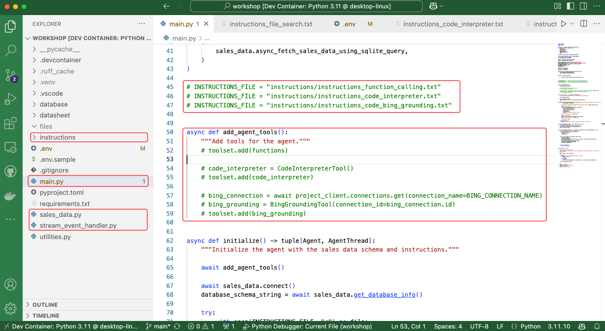
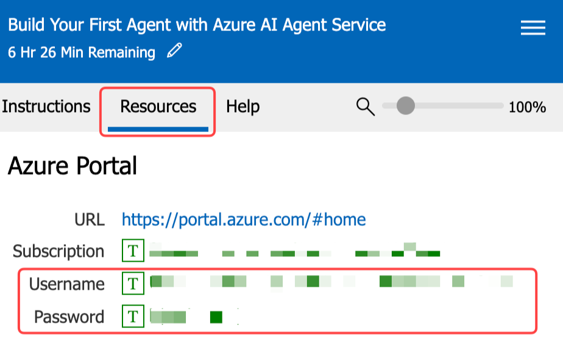

# Setup: AI Tour Attendees

The instructions on this page assume you are participating in the [Microsoft AI Tour](https://aitour.microsoft.com) and have access to a pre-configured lab environment. This environment provides an Azure subscription with all the tools and resources needed to complete the workshop. 

If you are **not** part of the AI Tour, you can run this workshop using your own Azure subscription. In that case, refer to the [Self-guided Learners Introduction](./introduction-self-guided.md) to set up your environment and begin the workshop.

## Introduction

This workshop is designed to teach you about the Azure AI Agents Service and the Python SDK. It consists of multiple labs, each highlighting a specific feature of the Azure AI Agents Service. The labs are meant to be completed in order, as each one builds on the knowledge and work from the previous lab.

## Lab Structure

Each lab in this workshop includes:

- An **Introduction**: Explains the relevant concepts.
- An **Exercise**: Guides you through the process of implementing the feature.

## Project Structure

When you open the workshop in Visual Studio Code, you'll see the following folder structure. Take note of the key folders and files you'll be working with during the workshop:

1. The **files folder**: Contains the files created by the agent app.
1. The **instructions folder**: Contains the instructions passed to the LLM.
1. The **main.py**: The entry point for the app, containing its main logic.
1. The **sales_data.py**: Contains the function logic to execute dynamic SQL queries against the SQLite database.
1. The **stream_event_handler.py**: Contains the event handler logic for token streaming.



## Authenticate with Azure

You need to authenticate with Azure so the agent app can access the Azure AI Agents Service and models. Follow these steps:

1. Open a terminal window. The terminal app is **pinned** to the Windows 11 taskbar.

    { width="300" }

2. Run the following command to authenticate with Azure:

    ```powershell
    az login
    ```

    !!! note
        You'll be prompted to open a browser link and log in to your Azure account.

        1. A browser window will open automatically, select **Work or school account** and click **Next**.

        1. Use the **Username** and **Password** found in the top section of the **Resources** tab in the lab environment.

        2. Select **OK**, then **Done**.

3. Then select the **Default** subscription from the command line.
   
4. Once you've logged in, run the following command to assign the **user** role to the resource group:

    ```powershell
    $subId = $(az account show --query id --output tsv) `
    ;$objectId = $(az ad signed-in-user show --query id -o tsv) `
    ; az role assignment create --role "f6c7c914-8db3-469d-8ca1-694a8f32e121" --assignee-object-id $objectId --scope /subscriptions/$subId/resourceGroups/"rg-agent-workshop" --assignee-principal-type 'User'
    ```

5. Leave the terminal window open for the next steps.

## Open the Workshop

Follow these steps to open the workshop in Visual Studio Code:

<!-- 1. Open a terminal window. The terminal app is **pinned** to the Windows 11 taskbar.

    { width="300" } -->

1. From the terminal window, execute the following commands to clone the workshop repository, navigate to the relevant folder, set up a virtual environment, activate it, and install the required packages:

    ```powershell
    git clone https://github.com/microsoft/build-your-first-agent-with-azure-ai-agent-service-workshop.git `
    ; cd build-your-first-agent-with-azure-ai-agent-service-workshop/src/workshop `
    ; python -m venv .venv `
    ; .\.venv\Scripts\activate `
    ; pip install -r requirements.txt `
    ; code --install-extension tomoki1207.pdf
    ```

2. Open in VS Code. From the terminal window, run the following command:

    ```powershell
    code .
    ```

    !!! warning "When the project opens in VS Code, two notifications appear in the bottom right corner. Click ✖ to close both notifications."

## Project Connection String

Next, we log in to Azure AI Foundry to retrieve the project connection string, which the agent app uses to connect to the Azure AI Agents Service.

1. Navigate to the [Azure AI Foundry](https://ai.azure.com){:target="_blank"} website.
2. Select **Sign in** and use the **Username** and **Password** found in the top section of the **Resources** tab in the lab environment. Click on the **Username** and **Password** fields to automatically fill in the login details.
    {:width="500"}
3. Read the introduction to the Azure AI Foundry and click **Got it**.
4. Ensure you are on the AI Foundry home page. Click the **AI Foundry** tab in the top left corner.

    {:width="200"}

5. Select the project name that starts with **aip-**.

    {:width="500"}

6. Review the introduction guide and click **Close**.
7. Locate the **Project details** section, click the **Copy** icon to copy the **Project connection string**.

    {:width="500"}

## Configure the Workshop

1. Switch back to workshop you opened in VS Code.
2. **Rename** the `.env.sample` file to `.env`.

    - Select the **.env.sample** file in the VS Code **Explorer** panel.
    - Right-click the file and select **Rename**, or press <kbd>F2</kbd>.
    - Change the file name to `.env` and press <kbd>Enter</kbd>.

3. Paste the **Project connection string** you copied from Azure AI Foundry into the `.env` file.

    ```python
    PROJECT_CONNECTION_STRING="<your_project_connection_string>"
    ```

    Your `.env` file should look similar to this but with your project connection string.

    ```python
    MODEL_DEPLOYMENT_NAME="gpt-4o"
    BING_CONNECTION_NAME="Grounding-with-Bing-Search"
    PROJECT_CONNECTION_STRING="<your_project_connection_string>"
    ```

4. Save the `.env` file.

## Pro Tips

!!! tips
    1. The **Burger Menu** in the right-hand panel of the lab environment offers additional features, including the **Split Window View** and the option to end the lab. The **Split Window View** allows you to maximize the lab environment to full screen, optimizing screen space. The lab's **Instructions** and **Resources** panel will open in a separate window.
    2. If the lab instructions are slow to scroll in the lab environment, try copying the instructions’ URL and opening it in **your computer’s local browser** for a smoother experience.
    3. If you have trouble viewing an image, simply **click the image to enlarge it**.
