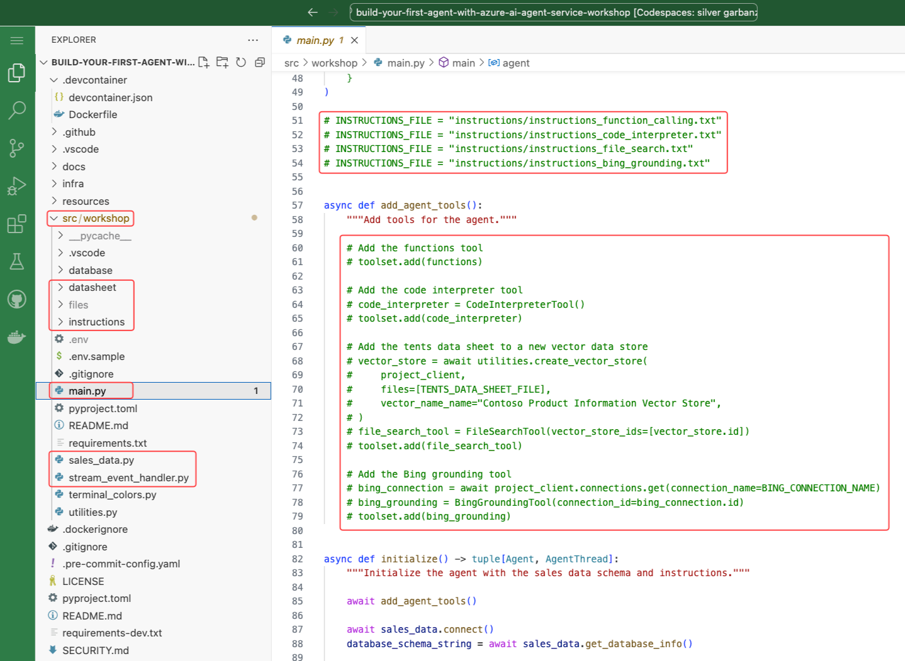
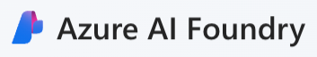
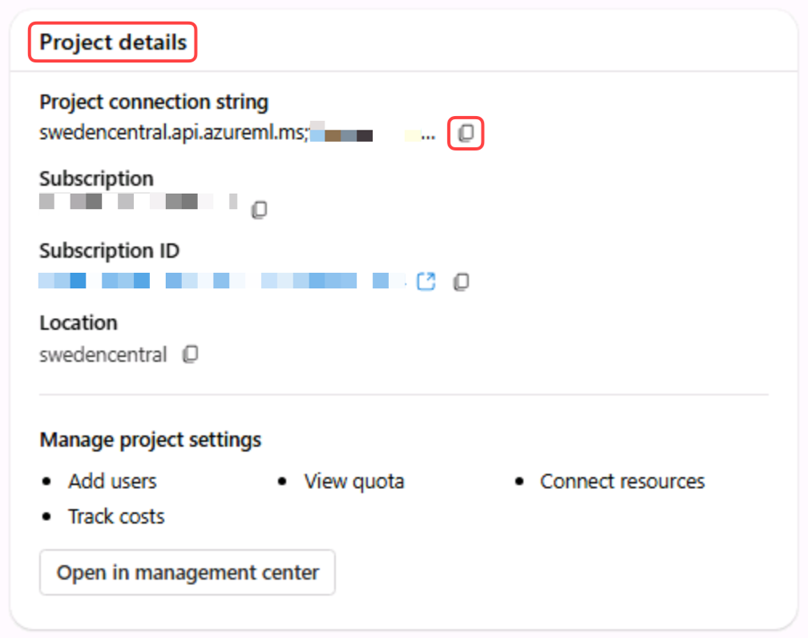

# Setup: Self-Guided Learners

These instructions are for self-guided learners who are not part of the AI Tour and do not have access to a pre-configured lab environment. Follow these steps to set up your environment and begin the workshop.

## Introduction

This workshop is designed to teach you about the Azure AI Agents Service and the [associated Python SDK](https://learn.microsoft.com/python/api/overview/azure/ai-projects-readme?context=%2Fazure%2Fai-services%2Fagents%2Fcontext%2Fcontext&view=azure-python-preview). It consists of multiple labs, each highlighting a specific feature of the Azure AI Agents Service. The labs are meant to be completed in order, as each one builds on the knowledge and work from the previous lab.

## Prerequisites

1. Access to an Azure subscription. If you don't have an Azure subscription, create a [free account](https://azure.microsoft.com/free/){:target="_blank"} before you begin.
1. You need a GitHub account. If you don’t have one, create it at [GitHub](https://github.com/join){:target="_blank"}.

## GitHub Codespaces

The preferred way to run this workshop is using GitHub Codespaces. This option provides a pre-configured environment with all the tools and resources needed to complete the workshop.

Select **Open in GitHub Codespaces** to open the project in GitHub Codespaces.

[](https://codespaces.new/microsoft/build-your-first-agent-with-azure-ai-agent-service-workshop){:target="_blank"}

!!! Warning "It will take several minutes to build the Codespace so carry on reading the instructions while it builds."

## Lab Structure

Each lab in this workshop includes:

- An **Introduction**: Explains the relevant concepts.
- An **Exercise**: Guides you through the process of implementing the feature.

## Project Structure

The workshop’s source code is located in the **src/workshop** folder. Be sure to familiarize yourself with the key **subfolders** and **files** you’ll be working with throughout the session.

1. The **files folder**: Contains the files created by the agent app. 
1. The **instructions folder**: Contains the instructions passed to the LLM.
1. The **main.py** Python script: The entry point for the app, containing its main logic.
1. The **sales_data.py** Python script: Contains the function logic to execute dynamic SQL queries against the SQLite database.
1. The **stream_event_handler.py** Python script: Contains the event handler logic for token streaming.

!!! info "The `files/` folder is created during agent execution and is not checked into source control. As a result, you will NOT see this folder in your forked repository by default - but you will see it during runtime"



## Authenticate with Azure

You need to authenticate with Azure so the agent app can access the Azure AI Agents Service and models. Follow these steps:

1. Ensure the Codespace has been created.
1. In the Codespace, open a new terminal window by selecting **Terminal** > **New Terminal** from the **VS Code menu**.
2. Run the following command to authenticate with Azure:

    ```powershell
    az login --use-device-code
    ```

    !!! note
        You'll be prompted to open a browser link and log in to your Azure account.

        1. A browser window will open automatically, select your account type and click **Next**.
        2. Sign in with your Azure subscription **Username** and **Password**.
        3. Select **OK**, then **Done**.

3. Then select the appropriate subscription from the command line.
4. Leave the terminal window open for the next steps.

## Deploy the Azure Resources

The following resources will be created in the `rg-contoso-agent-workshop` resource group in your Azure subscription. You may deploy in any region where the services are available.

- An **Azure AI Foundry hub** named **agent-wksp**
- An **Azure AI Foundry project** named **Agent Service Workshop** 
- A **Serverless (pay-as-you-go) GPT-4o model deployment** named **gpt-4o (Global 2024-08-06)**. See pricing details [here](https://azure.microsoft.com/pricing/details/cognitive-services/openai-service/){:target="_blank"}.
- A **Grounding with Bing Search** resource. See the [documentation](https://learn.microsoft.com/azure/ai-services/agents/how-to/tools/bing-grounding) and [pricing](https://www.microsoft.com/en-us/bing/apis/grounding-pricing) for details.

!!! warning "You will need 140K TPM quota availability in for the gpt-4o Global Standard SKU, not because the agent uses a lot of tokens, but because of the rate calls are made by the agent to the model. Review your quota availability in the [AI Foundry Management Center](https://ai.azure.com/managementCenter/quota)."

We have provided a bash script to deploy the required resources. Alternatively, you may deploy resources manually using Azure AI Foundry studio -- see below for details.

The script `deploy.sh` deploys to the `eastus2` region by default; edit the file to change the region or resource names. To run the script, open the VS Code terminal and run the following command:

```bash
cd infra && ./deploy.sh
```

### Workshop Configuration File

The deploy script generates the **src/workshop/.env** file, which contains the project connection string, model deployment name, and Bing connection name.

Your **.env** file should look similar to this but with your project connection string.

```python
MODEL_DEPLOYMENT_NAME="gpt-4o"
BING_CONNECTION_NAME="groundingwithbingsearch"
PROJECT_CONNECTION_STRING="<your_project_connection_string>"
```

## (optional) Manual Deployment in AI Foundry studio

If you have already completed the prior step and the `deploy.sh` script completed successfully, you can skip to the next section.

Alternatively, if you prefer not to use the `deploy.sh` script you can deploy the resources manually using the Azure AI Foundry portal as follows:

1. Visit `ai.azure.com` and sign into your account
2. Click "+ Create project"
    - Project name: agent-workshop
    - Hub: Create new hub, name: agent-workshop-hub
    - Click Create and wait for the project to be created
3. In "My assets", click "Models + endpoints"
4. Click Deploy Model / Deploy Base Model
    - select gpt-4o, click Confirm
    - Deployment name: gpt-4o
    - Deployment type: Global Standard
    - Click Customize
    - Model version: 2024-08-06
    - Tokens Per Minute Rate Limit: 140k
    - Click deploy

!!! note 
    A specific version of GPT-4o may be required depending on your the region where you deployed your project.
    See [Models: Assistants (Preview)](https://learn.microsoft.com/en-us/azure/ai-services/openai/concepts/models?tabs=global-standard%2Cstandard-chat-completions#assistants-preview) for details.

<!-- ## Project Connection String

Next, we log in to Azure AI Foundry to retrieve the project connection string, which the agent app uses to connect to the Azure AI Agents Service.

1. Navigate to the [Azure AI Foundry](https://ai.azure.com){:target="_blank"} website.
2. Sign in with your Azure subscription **Username** and **Password**.
3. Read the introduction to the Azure AI Foundry and click **Got it**.
4. Ensure you are on the AI Foundry home page. Click the **AI Foundry** tab in the top left corner.

    {:width="200"}

5. Select the **agent-workshop** project.
6. Review the introduction guide and click **Close**.
7. Locate the **Project details** section, click the **Copy** icon to copy the **Project connection string**.

    {:width="500"} -->

### Workshop Configuration File

Create the workshop configuration file with the following command:

```
cp src/workshop/.env.sample src/workshop/.env
```

Then edit the file `src/workshop/.env` to provide the Project Connection String. You can find this string in the AI Foundry portal in the Overview page for your Project `agent-project` (look in the Project details section).

