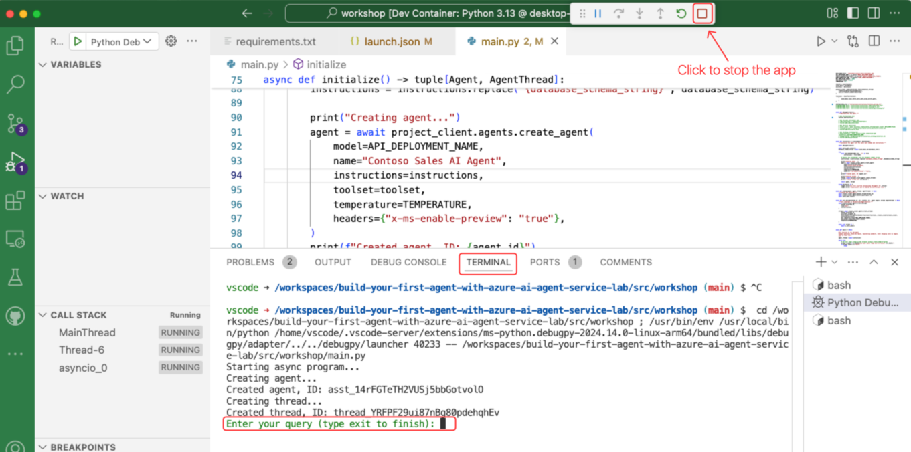
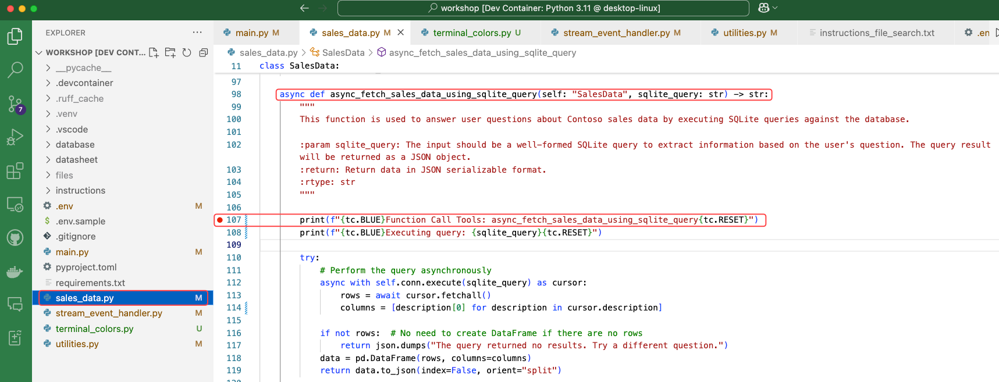

## Introduction

### What is Function Calling

Function calling enables Large Language Models (LLMs) to interact with external systems, execute tasks, and integrate with APIs. The LLM determines when to invoke a function based on user prompts and returns structured data for app use. Developers then implement the function logic within the app.

In this workshop, the function logic is used to execute the LLM dynamically generated SQL queries against the SQLite database.

### Enabling Function Calling

If you’re familiar with [Azure OpenAI Function Calling](https://learn.microsoft.com/azure/ai-services/openai/how-to/function-calling){:target="_blank"}, it requires defining a function schema for the LLM. Azure AI Agent Service supports this approach and also offers a more flexible option.

With the Azure AI Agent Service and its Python SDK, you can define the function schema directly within the Python function’s docstring. This approach keeps the definition and implementation together, simplifying maintenance and enhancing readability.

For example, in the **sales_data.py** file, the **async_fetch_sales_data_using_sqlite_query** function uses a docstring to specify its signature, inputs, and outputs. The SDK parses this docstring to generate the callable function for the LLM:

``` python

async def async_fetch_sales_data_using_sqlite_query(self: "SalesData", sqlite_query: str) -> str:
    """
    This function is used to answer user questions about Contoso sales data by executing SQLite queries against the database.

    :param sqlite_query: The input should be a well-formed SQLite query to extract information based on the user's question. The query result will be returned as a JSON object.
    :return: Return data in JSON serializable format.
    :rtype: str
    """
```

### Dynamic SQL Generation

When the app starts, it incorporates the database schema and key data into the instructions for the Azure AI Agent Service. Using this input, the LLM generates SQLite-compatible SQL queries to respond to user requests expressed in natural language.

## Lab Exercise

In this lab, you'll enable the function logic to execute dynamic SQL queries against the SQLite database. The function will be called by the LLM to answer user questions about Contoso sales data.

1. Open the `main.py`.

1. **Uncomment** the following lines by removing the **"# "** characters

    ```python
    # INSTRUCTIONS_FILE = "instructions/instructions_function_calling.txt"

    # toolset.add(functions)
    ```

    !!! warning
        The lines to be uncommented are not adjacent. When removing the # character, ensure you also delete the space that follows it.

1. Review the Code in main.py.

    After uncommenting, your code should look like this:

    ``` python
    INSTRUCTIONS_FILE = "instructions/instructions_function_calling.txt"
    # INSTRUCTIONS_FILE = "instructions/instructions_code_interpreter.txt"
    # INSTRUCTIONS_FILE = "instructions/instructions_file_search.txt"
    # INSTRUCTIONS_FILE = "instructions/instructions_bing_grounding.txt"


    async def add_agent_tools():
        """Add tools for the agent."""

        # Add the functions tool
        toolset.add(functions)

        # Add the code interpreter tool
        # code_interpreter = CodeInterpreterTool()
        # toolset.add(code_interpreter)

        # Add the tents data sheet to a new vector data store
        # vector_store = await utilities.create_vector_store(
        #     project_client,
        #     files=[TENTS_DATA_SHEET_FILE],
        #     vector_name_name="Contoso Product Information Vector Store",
        # )
        # file_search_tool = FileSearchTool(vector_store_ids=[vector_store.id])
        # toolset.add(file_search_tool)

        # Add the Bing grounding tool
        # bing_connection = await project_client.connections.get(connection_name=BING_CONNECTION_NAME)
        # bing_grounding = BingGroundingTool(connection_id=bing_connection.id)
        # toolset.add(bing_grounding)
    ```

### Review the Instructions

Open the **src/workshop/instructions/instructions_function_calling.txt** file and review the **Tools** section for details on the function-calling instructions.

!!! tip "In VS Code, press Alt + Z (Windows/Linux) or Option + Z (Mac) to enable word wrap mode, making the instructions easier to read."

The Instructions file `instructions_function_calling.txt` is interpreted by the `gpt-4o` model to define the behavior of our agent. So far, it:

- **Defines the role** of our agent: "Your role is to assist Contoso users with sales data inquiries with a polite."
- **Provides contextual information** of use to the agent: "Contoso is a online outdoors camping and sports gear retailer."
- **Defines the "Sales data assistance" tool** that the agent will use to respond to user queries. In detail, it:
    - defines a function the agent can use to form a SQL query and run it on a database
    - provides information about the database schema to help the agent form its query
    - asks for aggregated data and at most 30 rows of data
    - formats the output as Markdown tables
- **Provides general guidance** for queries, including to make responses "actionable and relevent"
- **Suggests tips** to provide to user when they ask for help
- **Sets safety and conduct procedures**, for when users ask questions that are unclear, out of scope, or malicious.

We will enhance these instructions during the lab to add additional tools that expand the capabilities of the agent.

!!! info
    The {database_schema_string} placeholder in the instructions is replaced with the actual database schema when the app initializes.

    ```python
    # Replace the placeholder with the database schema string
    instructions = instructions.replace("{database_schema_string}", database_schema_string)
    ```

<!-- ### Review the Function Logic

Examine the **async_fetch_sales_data_using_sqlite_query** function in the **sales_data.py** file.

!!! note annotate "The SDK parses the function’s docstring to generate the function definition passed to the LLM. This function is invoked by the LLM to execute dynamic SQL queries."

```python
async def async_fetch_sales_data_using_sqlite_query(self: "SalesData", sqlite_query: str) -> str:
        """
        This function is used to answer user questions about Contoso sales data by executing SQLite queries against the database.

        :param sqlite_query: The input should be a well-formed SQLite query to extract information based on the user's question. The query result will be returned as a JSON object.
        :return: Return data in JSON serializable format.
        :rtype: str
        """
``` -->

### Run the Agent App

1. Press <kbd>F5</kbd> to run the app.
2. In the terminal, you'll see the app start, and the agent app will prompt you to enter your query.

    {:width="600"}

### Start a Conversation with the Agent

Start asking questions about Contoso sales data. For example:

1. **Help**

    Here is an example of the LLM response to the **help** query:

    *I’m here to help with your sales data inquiries at Contoso. Could you please provide more details about what you need assistance with? Here are some example queries you might consider:*

    - *What were the sales by region?*
    - *What was last quarter's revenue?*
    - *Which products sell best in Europe?*
    - *Total shipping costs by region?*

    *Feel free to ask any specific questions related to Contoso sales data!*

    !!! tip
        The LLM will provide a list of starter questions that were defined in the instructions file.
        Try asking help in your language, for example `help in Hindi` or `help in Italian`.

2. **Show the 3 most recent transaction details**

    In the response you can see the raw data stored in the SQLite database. Each record is a single
    sales transaction for Contoso, with information about the product, product category, sale amount and region, date, and much more. 

    !!! warning
        The agent may refuse to respond to this query with a message like "I'm unable to provide individual transaction details". This is because the instructions direct it to "provide aggregated results by default". If this happens, try again, or reword your query.

        Large Language models have random behavior, and may give different responses even if you repeat the same query.

3. **What are the sales by region?**

    Here is an example of the LLM response to the **sales by region** query:

        | Region         | Total Revenue  |
        |----------------|----------------|
        | AFRICA         | $5,227,467     |
        | ASIA-PACIFIC   | $5,363,718     |
        | CHINA          | $10,540,412    |
        | EUROPE         | $9,990,708     |
        | LATIN AMERICA  | $5,386,552     |
        | MIDDLE EAST    | $5,312,519     |
        | NORTH AMERICA  | $15,986,462    |

    So, what’s happening behind the scenes to make it all work?

    The LLM orchestrates the following steps:

    1. The LLM generates an SQL query to answer the user's question. For the question **"What are the sales by region?"**, the following SQL query is generated:

        ```
        SELECT region, SUM(revenue) AS total_revenue FROM sales_data GROUP BY region;
        ```

    1. The LLM then asks the agent app to call the **async_fetch_sales_data_using_sqlite_query** function, which retrieves the required data from the SQLite database and returns it to the LLM.
    2. Using the retrieved data, the LLM generates a table in Markdown format and returns it to the user. If you check the instructions file, you'll notice that the default output format is Markdown.


4. **Show sales by category in Europe**


    In this case, an even more complex SQL query is being run by the agent.

5. **Breakout sales by footwear**

    Note how much interpetation the agent does here: determining what product types fit should be included in "footwear", and understanding the unclear term "breakout".

6. **Show sales by region as a pie chart**

    Our agent can't create charts ... yet. We'll fix that in the next lab.

## (optional) Debug the App

Set a [breakpoint](https://code.visualstudio.com/Docs/editor/debugging){:target="_blank"} in the `async_fetch_sales_data_using_sqlite_query` function located in `sales_data.py` to observe how the LLM requests data.

!!! info "Note: To use the debug feature, exit the previous run. Then set the breakpoint. Then run the application using the debugger icon in the sidebar. This will open up the debug sidebar, allowing you to watch stack traces and step through execution."

{:width="600"}

### Ask More Questions

Now that you’ve set a breakpoint, ask additional questions about Contoso sales data to observe the function logic in action. Step through the function to execute the database query and return the results to the LLM.

Try these questions:

1. **What regions have the highest sales?**
2. **What were the sales of tents in the United States in April 2022?**

### Disable the Breakpoint

Remember to disable the breakpoint before running the app again.

## Stop the Agent App

When you're done, type **exit**, or press <kbd>Shift</kbd>+<kbd>F5</kbd> to stop the agent app.

